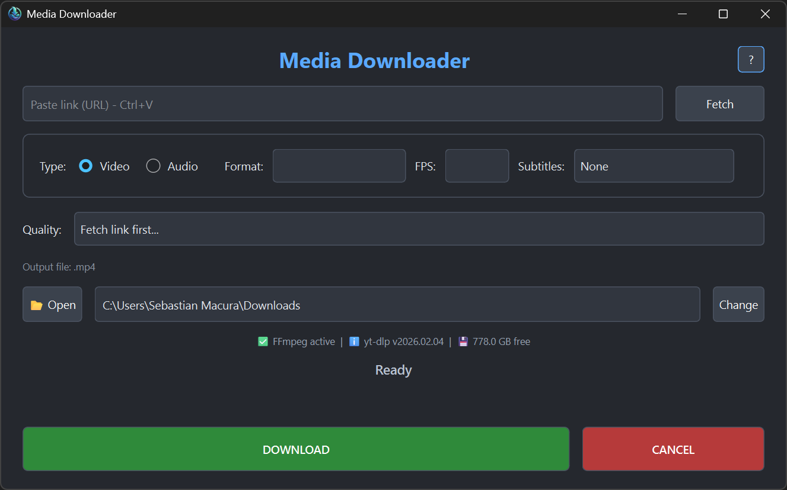

# Universal Video Downloader



## About

**Universal Video Downloader** is a user-friendly desktop application built with PyQt6 that allows you to download videos and extract audio from various online platforms. Powered by `yt-dlp`, it supports YouTube, TikTok, Instagram, and many other video hosting services.

The application features an intuitive graphical interface that simplifies the download process while providing advanced options for power users.

## Features

- Download videos in available formats and resolutions
- Extract audio (MP3, M4A, FLAC, OPUS, WAV)
- Ability to choose preferred framerate (if available)
- System info display (FFmpeg status, yt-dlp version, disk space)
- Customizable save location

## How to Use

### Getting Started

1. **Download** the latest release from the [Releases](../../releases) page
2. **Extract** the `.exe` file to your preferred location
3. **Run** the application - no installation needed

### Downloading Videos

1. Paste a video link from any supported platform
2. Click "Fetch" to retrieve available formats
3. Choose between **Video** or **Audio** mode
4. Select desired **Format** and **Quality**
5. Click "DOWNLOAD"

### Settings Explained

- Click the "?" for detailed explanations of each setting.

## Signature Warning

This application is **not code-signed**. When you download and run the `.exe` file, Windows may display security warnings such as:

```
Windows Defender SmartScreen prevents an unrecognized app from starting. Running this app might put your PC at risk.
```

**This is normal.** Code signing certificates are expensive and I'm not paying for that. To continue:

1. Click **"More info"** 
2. Click **"Run anyway"**
3. The application will launch normally

## Compiling from Source
If you want to compile the application yourself, download the `uvd.spec` file and make sure you have Python and PyInstaller installed, then run:

```bash
pyinstaller --clean uvd.spec
```

## System Requirements

- **FFmpeg** (optional but recommended for best results)
  - Bundled in the portable package, or
  - Download from:
    [ffmpeg.org](https://ffmpeg.org/download.html)
    or via cmd using winget:
    ```
    winget install ffmpeg
    ```


## License: [MIT License](LICENSE)

You are free to:
- Use for personal and commercial purposes
- Modify and distribute
- Include in other projects

## Credits

Built with:
- [PyQt6](https://www.riverbankcomputing.com/software/pyqt/) - GUI Framework
- [yt-dlp](https://github.com/yt-dlp/yt-dlp) - Video Downloader
- [FFmpeg](https://ffmpeg.org/) - Media Processor

## Issues & Feedback

Found a bug or have a suggestion? Please [open an issue](../../issues) on GitHub!

**Happy downloading!**
